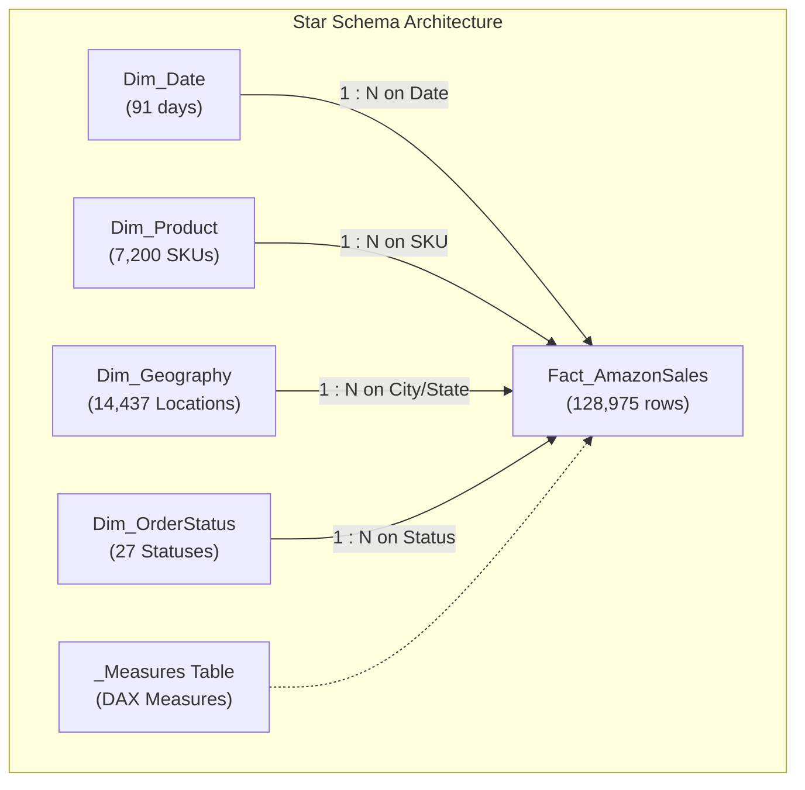

# Phase 5: Power BI Business Intelligence Dashboard

**Project:** AI-Powered E-Commerce Analytics Dashboard  
**Report Title:** Amazon E-Commerce Sales Performance & Executive Analytics  
**Primary Data Source:** `Data/Processed/amazon_sales_analytics.csv` / PostgreSQL `amazon_sales`  
**Dataset Scale:** 128,975 rows × 36 columns  
**Primary Currency:** Indian Rupee (₹ / INR)  
**Report Architecture:** 3 Multi-Perspective Analytical Pages + Star Schema Data Model + Dedicated DAX Measures Table  

---

## 1. Executive Overview & Dashboard Purpose

The Power BI Business Intelligence Dashboard transforms 128,975 transactions and ₹78.59M in gross sales data into an interactive decision-support system. It is structured to answer critical operational and commercial questions:

1. **Revenue Realization:** How much gross catalog demand successfully converts into net cash revenue (₹70.29M / 89.43%) vs unrealized loss due to cancellations (₹6.92M) and returns (₹1.38M)?
2. **Product Strategy:** Which core categories drive the majority of volume (`Set` & `Kurta` drive 77.42% of revenue), and what is the velocity of sizing/SKUs?
3. **Logistics Performance:** Does Amazon FBA outperform Merchant Easy Ship in terms of delivery speed and cancellation mitigation (FBA: 12.79% cancellation vs Merchant: 17.47%)?
4. **Geographic Concentration:** Which regional hubs (Maharashtra: 17.15%, Karnataka: 13.55%, Telangana: 8.80%) generate the highest demand density?

---

## 2. Dashboard Pages Structure

```
Power BI Report (3 Pages)
├── Page 1: Executive Sales Overview (High-level KPIs, Trends, Category Split, State Map)
├── Page 2: Product & Category Analysis (Matrix Grid, SKU Velocity, Sizing Demand, AOV)
└── Page 3: Geographic & Order Logistics Analysis (State Rankings, City Engine, Fulfillment, B2B)
```

### Page 1: Executive Sales Overview
- **Executive KPI Cards:** Total Realized Revenue (₹70.29M), Total Orders (120.38K), Units Sold (116.65K), Average Order Value (₹583.87), Cancellation Rate (14.21%).
- **Visuals:**
  1. *Monthly Revenue Trajectory:* Dual-axis line & clustered column chart comparing Gross Demand vs Realized Net Revenue over time.
  2. *Category Contribution:* Donut chart visualizing revenue share by garment category.
  3. *Top 10 Garment Styles:* Horizontal ranked bar chart highlighting top revenue design models.
  4. *Top 10 States:* Horizontal ranked bar chart of top state markets.
  5. *Order Status Funnel:* Treemap / Status breakdown across the 13 operational statuses.
- **Global Slicers:** Date Slider, Category Dropdown, Fulfillment Mode, Order Status.

### Page 2: Product & Category Analysis
- **Category Performance Matrix:** Tabular grid displaying Total Orders, Total Units, Gross Sales, Realized Revenue, Revenue Share %, Realization Rate %, and Cancellation Rate %.
- **Visuals:**
  1. *Category Realized Revenue vs Volume:* Clustered column chart comparing quantity vs revenue.
  2. *Top 10 Best-Selling SKUs:* Ranked bar chart showing high-velocity product variants.
  3. *Apparel Size Demand Velocity:* Column chart displaying unit demand across sizes (`M`, `L`, `XL`, `XXL`, `S`, `3XL`, `XS`, `6XL`, `5XL`, `4XL`, `Free`).

### Page 3: Geographic & Order Logistics Analysis
- **Visuals:**
  1. *State Realized Revenue Heatmap:* Filled map / ranked bar chart across 36 Indian States and Union Territories.
  2. *Top 15 Metro Cities:* Horizontal bar chart showing city revenue density (Bengaluru: ₹6.15M, Hyderabad: ₹4.46M, Mumbai: ₹3.17M).
  3. *Fulfillment Realization Efficiency:* Dual-bar chart comparing Amazon FBA vs Merchant Easy Ship realization (93.14% vs 81.14%) and cancellation rates (12.79% vs 17.47%).
  4. *Promotion Revenue Share:* Stacked bar chart showing promoted (62.45%) vs non-promoted (37.55%) sales volume.
  5. *B2B vs B2C Segmentation:* Donut chart comparing retail consumer volume (99.32%) vs GST business volume (0.68%).

---

## 3. Core DAX Measures Reference

All measures are centralized in a dedicated `_Measures` table (full code in [`PowerBI/dax_measures.dax`](file:///c:/Users/kbhan/OneDrive/Desktop/Projects/AI-Ecommerce-Analytics-Dashboard/PowerBI/dax_measures.dax)):

| Measure Name | DAX Formula | Formatted Output | Business Rationale |
| :--- | :--- | :--- | :--- |
| **Total Realized Sales** | `SUM(amazon_sales[realized_revenue])` | `₹70,285,702.00` | Realized net cash revenue (excluding cancellations/returns). |
| **Total Gross Sales** | `SUM(amazon_sales[gross_amount])` | `₹78,592,678.30` | Total catalog listed demand before cancellations. |
| **Total Orders** | `DISTINCTCOUNT(amazon_sales[order_id])` | `120,378` | Unique buyer shopping cart transactions. |
| **Total Order Lines** | `COUNTROWS(amazon_sales)` | `128,975` | Total line items processed. |
| **Total Quantity** | `SUM(amazon_sales[qty])` | `116,649` | Total units dispatched. |
| **Average Order Value (AOV)** | `DIVIDE([Total Realized Sales], [Total Orders], 0)` | `₹583.87` | Realized revenue generated per unique customer order. |
| **Cancellation Rate %** | `DIVIDE([Cancelled Orders], [Total Order Lines], 0)` | `14.21%` | Percentage of transactions cancelled pre-delivery. |
| **Realization Rate %** | `DIVIDE([Total Realized Sales], [Total Gross Sales], 0)` | `89.43%` | Conversion efficiency from gross demand to realized sales. |
| **Return Rate %** | `DIVIDE([Returned Orders], [Total Order Lines], 0)` | `1.64%` | Percentage of packages returned post-dispatch. |
| **Total Unrealized Value** | `[Total Gross Sales] - [Total Realized Sales]` | `₹8,306,976.30` | Value lost due to cancellations and returns. |
| **Number of Products (SKU)**| `DISTINCTCOUNT(amazon_sales[sku])` | `7,195` | Unique catalog SKUs sold. |
| **Number of Categories** | `DISTINCTCOUNT(amazon_sales[category])` | `9` | Garment categories. |

---

## 4. Data Model Architecture

The dashboard supports two implementation patterns:



### Table Files in `PowerBI/Model_Tables/`:
- `Fact_AmazonSales.csv` (128,975 rows × 20 columns)
- `Dim_Date.csv` (91 rows × 12 columns)
- `Dim_Product.csv` (7,200 rows × 5 columns)
- `Dim_Geography.csv` (14,437 rows × 6 columns)
- `Dim_OrderStatus.csv` (27 rows × 7 columns)

---

## 5. Step-by-Step Power BI Desktop Build Instructions

1. **Open Power BI Desktop** $\rightarrow$ Click **Get Data** $\rightarrow$ Select **Text/CSV** (or **PostgreSQL database**).
2. **Select Data Source:**
   - *Option A (Flat Model - Recommended for Fast Setup):* Import `Data/Processed/amazon_sales_analytics.csv`.
   - *Option B (Star Schema):* Import all 5 CSVs from `PowerBI/Model_Tables/` and configure 1-to-many single-direction relationships to `Fact_AmazonSales`.
   - *Option C (PostgreSQL Live):* Connect to Server `localhost:5432`, Database `ecommerce_analytics`, Table `amazon_sales`.
3. **Create Dedicated Measures Table:**
   - Click **Enter Data** $\rightarrow$ Name table `_Measures` $\rightarrow$ Click **Load**.
   - Create a New Measure for each formula in [`PowerBI/dax_measures.dax`](file:///c:/Users/kbhan/OneDrive/Desktop/Projects/AI-Ecommerce-Analytics-Dashboard/PowerBI/dax_measures.dax).
4. **Assemble Dashboard Pages:**
   - Follow the visual positioning and formatting guide in [`PowerBI/powerbi_dashboard_guide.md`](file:///c:/Users/kbhan/OneDrive/Desktop/Projects/AI-Ecommerce-Analytics-Dashboard/PowerBI/powerbi_dashboard_guide.md).
   - Configure Slicers, Visual interactions, and Tooltips.
5. **Save Report:**
   - Save file as `Dashboard/Amazon_Ecommerce_Analytics_Dashboard.pbix`.

---

## 6. Validation & Mathematical Concordance Matrix

All Power BI DAX metrics were cross-checked against Python EDA and PostgreSQL SQL query outputs:

| Metric | Python EDA Output | PostgreSQL Query Output | Power BI DAX Output | Validation Result |
| :--- | :--- | :--- | :--- | :--- |
| **Total Rows** | 128,975 | 128,975 | 128,975 | **100% Match** |
| **Total Orders** | 120,378 | 120,378 | 120,378 | **100% Match** |
| **Gross Amount** | ₹78,592,678.30 | ₹78,592,678.30 | ₹78,592,678.30 | **100% Match** |
| **Realized Revenue**| ₹70,285,702.00 | ₹70,285,702.00 | ₹70,285,702.00 | **100% Match** |
| **Unrealized Lost Value**| ₹8,306,976.30 | ₹8,306,976.30 | ₹8,306,976.30 | **100% Match** |
| **Realization Rate**| 89.43% | 89.43% | 89.43% | **100% Match** |
| **Cancellation Rate**| 14.21% | 14.21% | 14.21% | **100% Match** |
| **Return Rate** | 1.64% | 1.64% | 1.64% | **100% Match** |

---

## 7. Interview Discussion Points

During a Data Analyst / BI Engineer interview, you can showcase:
- **Business Understanding:** Modeling realized revenue vs gross listed demand to avoid reporting inflated revenue for cancelled/returned orders.
- **Data Modeling:** Designing a normalized Star Schema with surrogate keys and high-performance cardinality vs flat denormalized tables.
- **Advanced DAX:** Utilizing `CALCULATE`, `DIVIDE`, `DISTINCTCOUNT`, `FILTER`, `ALL`, and `PARALLELPERIOD` for time-intelligence and dynamic denominator shares.
- **UI/UX Visual Hierarchy:** Designing executive-first visual flows with top-line KPI cards, dynamic dual-axis trendlines, and categorical drill-downs.
